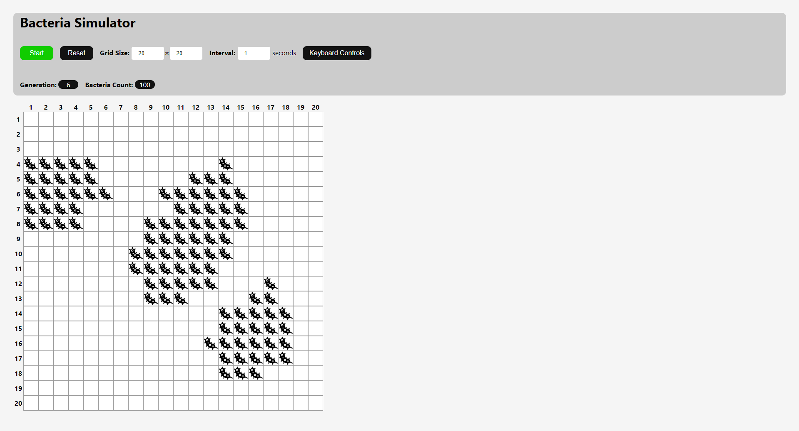

# Cell Growth Simulation
View the site on GitHub Pages [here](https://alex7d3.github.io/React-Bacteria-Simulator/).
This application simulates the growth patterns of bacterial colonies within a confined space.

The bacteria exist within a 2D grid, where each cell can be empty or contain a single bacterium. The cells divide/duplicate every fixed time interval. All bacteria populate a single free adjacent cell which is chosen at random.

Cells do not divide if all adjacent cells are occupied.
Bacteria can be added  manually by simply clicking on a cell, and removed by clicking again. The grid can be set to sizes between `1 x 1` and `50 x 50`.

An interval between bacteria duplication can be set between `1 second` and `60 seconds`.
Press the `Start/Stop` button to begin the simulation and pause it. While running, the application updates the generation number as well as the bacteria count.
Press the `Reset` button to clear the grid and reset the generation number and bacteria count.
## Keyboard Controls
- Start/Stop: `Space` 
- Reset `R Key`
- Adjust grid size: `↑ ↓ ← →`
## Performance Metrics
see [bacteria-simulation-performance](bacteria-simulation-performance.pdf).

# Getting Started with Create React App

This project was bootstrapped with [Create React App](https://github.com/facebook/create-react-app).

## Available Scripts

In the project directory, you can run:

### `npm start`

Runs the app in the development mode.\
Open [http://localhost:3000](http://localhost:3000) to view it in the browser.

The page will reload if you make edits.\
You will also see any lint errors in the console.

### `npm test`

Launches the test runner in the interactive watch mode.\
See the section about [running tests](https://facebook.github.io/create-react-app/docs/running-tests) for more information.

### `npm run build`

Builds the app for production to the `build` folder.\
It correctly bundles React in production mode and optimizes the build for the best performance.

The build is minified and the filenames include the hashes.\
Your app is ready to be deployed!

See the section about [deployment](https://facebook.github.io/create-react-app/docs/deployment) for more information.

### `npm run eject`

**Note: this is a one-way operation. Once you `eject`, you can’t go back!**

If you aren’t satisfied with the build tool and configuration choices, you can `eject` at any time. This command will remove the single build dependency from your project.

Instead, it will copy all the configuration files and the transitive dependencies (webpack, Babel, ESLint, etc) right into your project so you have full control over them. All of the commands except `eject` will still work, but they will point to the copied scripts so you can tweak them. At this point you’re on your own.

You don’t have to ever use `eject`. The curated feature set is suitable for small and middle deployments, and you shouldn’t feel obligated to use this feature. However we understand that this tool wouldn’t be useful if you couldn’t customize it when you are ready for it.

## Learn More

You can learn more in the [Create React App documentation](https://facebook.github.io/create-react-app/docs/getting-started).

To learn React, check out the [React documentation](https://reactjs.org/).
